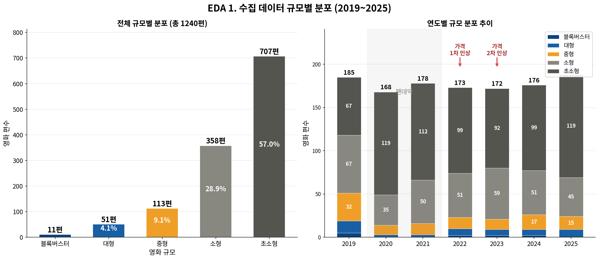

# 🎬 티켓값이 아니라, 개봉 첫 주가 중형 영화의 생사를 가른다

> KOBIS × TMDB 데이터로 본 중형 영화의 스크린 생존 요인 분석 (2019–2025)


빅데이터 프로젝트 · **9조 파워레인저 매직포스** · 지도교수 홍진근

---

## 🔑 핵심 발견 (반전)

이 프로젝트는 *"티켓값 인상이 중형 영화를 죽인다"* 는 통념에서 출발했지만, **데이터는 정반대를 가리켰다.**

| | 통념 | 데이터가 말한 것 |
| --- | --- | --- |
| 티켓값의 직접 효과 | 중형 영화의 사인(死因) | **생존 상관 r = 0.01 · SHAP 0.078 (6개 중 최하위)** |
| 진짜 결정 요인 | — | **개봉 첫 주 흥행 (SHAP 1위 0.571) + 평점** |

> 즉, 중형 영화의 2주차 생존을 가른 것은 티켓값이 아니라 **개봉 첫 주의 성적**이었다.

---

## 📌 프로젝트 개요

- **연구 질문** — 중형 영화의 2주차 생존(상영 유지)을 결정하는 요인은 무엇인가?
- **대상** — 2019~2025년 개봉작 **1,545편 → 전처리 후 1,240편** (중형 113편)
- **데이터** — KOBIS 오픈 API(박스오피스), TMDB API(평점)
- **핵심 종속변수** — `show_retention` = 2주차 평균 상영수 ÷ 1주차 평균 상영수
- **생존 타깃** — `survived` = show_retention ≥ 0.6 → 1

### 가설
| 가설 | 내용 | 결과 |
| --- | --- | --- |
| **H1 스크린 이탈** | 중형은 1주차 검증 실패 시 더 급격히 스크린을 잃는다 | ✅ 채택 |
| **H2 평점 괴리** | 중형은 평점과 무관하게 생존율이 낮다 | 🔶 부분 채택 |
| **H3 예측 가능성** | 1주차 흥행 + 평점으로 생존을 예측할 수 있다 | 🔍 탐색적 지지 |

---

## 📊 분석 결과

### H1 — 스크린 이탈 (채택)
- Kruskal-Wallis `p = 0.0001`, Mann-Whitney U (중형 vs 대형) `p = 0.0003`
- Cliff's δ = `−0.339` (중간 효과 크기)

### H2 — 평점 괴리 (부분 채택)
- 평점: 중형 7.00 vs 대형 7.15 (`p = 0.047`, 차이 미미)
- 생존율: 중형 **62.8%** vs 대형 **92.2%** (카이제곱 `p = 0.0002`)
- 평점–유지율 상관 Pearson `r = 0.183` (매우 약함)

### H3 — 예측 가능성 (탐색적 지지)
- 로지스틱 회귀, 5-Fold CV `AUC = 0.643` · Test `AUC = 0.698`
- SHAP: 첫 주 흥행 0.571(1위) · 평점(2위) · … · 가격 인상 0.078(최하위)
- ⚠️ 테스트셋 **23편**으로 작아 신뢰구간이 넓음 → *"예측된다"가 아니라 "탐색적으로 확인"*

> 📷 그래프는 `figures/` 폴더에 PNG를 넣으면 아래에서 렌더링됩니다.
>
> 
> 
> 
> 

---

## 🗂 레포 구조

```
movie-survival-analysis/
├── README.md
├── requirements.txt
├── .gitignore
├── src/
│   └── visualizations.py     # 전처리 진단 + EDA + 가설검정 시각화 (10블록)
├── figures/                  # 코드 실행 결과 PNG 저장 위치
└── data/                     # 원본/전처리 데이터 (README 참고)
```

`src/visualizations.py` 는 `# %%` 셀 구분선으로 나뉘어 있어 Colab/Jupyter에 그대로 옮길 수 있습니다.

---

## ▶️ 실행 방법

```bash
# 1) 의존성 설치
pip install -r requirements.txt

# 2) data/ 에 movie_features_with_tmdb.csv 를 넣고 실행
python src/visualizations.py
```

Google Colab에서는 `src/visualizations.py` 의 `# %%` 블록을 셀 단위로 붙여넣고, 상단 SETUP 셀에서 CSV를 업로드하면 됩니다.

---

## ⚠️ 한계

- **표본** — 중형 113편 · 테스트셋 23편으로 성능 단정 어려움
- **인과 미검증** — 가격 인상(2022~)과 팬데믹(2020~21)이 `r = −0.75`로 시기가 겹쳐 두 효과 분리 불가 → "상관"까지만 규명
- **외부 변수** — OTT 경쟁·동시 개봉작·스크린 점유율 미반영

---

## 👥 팀

| 이름 | 학번 |
| --- | --- |
| 주민규 | 20214066 |
| 김덕형 | 20261232 |
| 전성우 | 20243013 |
| 김동휘 | 20211277 |
